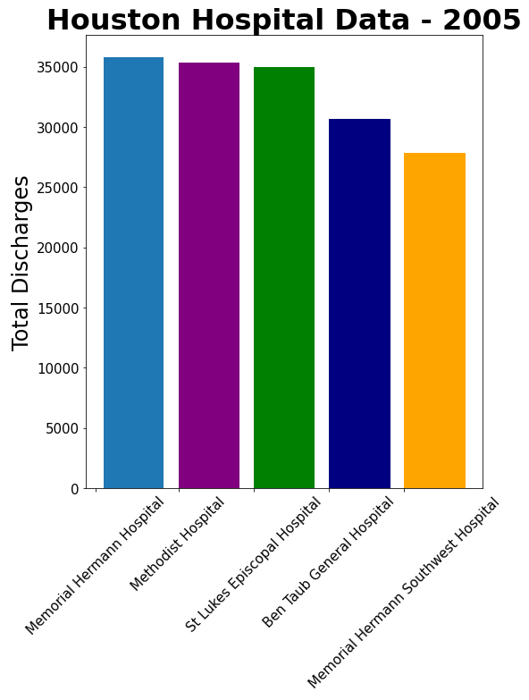
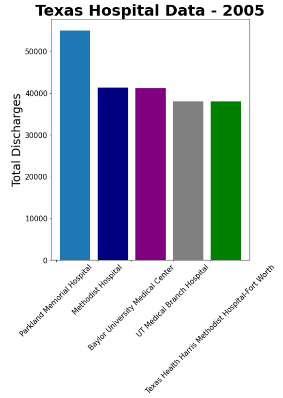
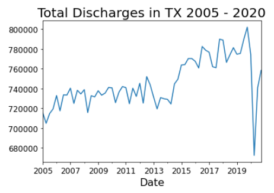
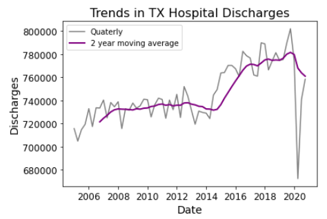

# Texas Hospital Discharge Trends -- Helping the community understand healthcare

**Author**: [Doug Mill](mailto:douglas_mill@live.com)

## Overview 

The healthcare system has always been something I've been interested in but never really understood well. It is an industry which is notorious for having hard to access data. This is fair because patient privacy comes first as it should. I was able to access some data from the Texas Department of State Health Services. It is all public use data and can be found at this link: https://www.dshs.texas.gov/thcic/hospitals/Inpatientpudf.shtm.
<br>
There was statistics on hospital discharges dating back to 2005 and the last year which has complete data is 2020. 2021 has partial data (quarter 1 only). I conducted some EDA on it but ultimately omitted it for visuals and my time series analysis. The reason why I chose discharges is because there is no implication on ethics or privacy, it shows some interesting trends of hospital usage over the years, and it is easy to understand. With the emergence of Covid in the past couple years, trends in healthcare and hospitals are as important as ever and I want to share my findings with the community.

## Business Understanding

I just want to share some information with the community that they might not have seen or understood otherwise. I am here to present some good news for the community about the efficiency of hospitals, the increased access and growing number of locations of hospitals over the years, and more. 

## Data Understanding and Preparation

The data that I am working with can be found in the aforementioned link. It is public use data. There are no names or privacy violations. I understand the importance of data ethics especially related to healthcare and made sure to navigate the general hospital trends rather than examine any individual patient data.
Each year from 2005 onwards has it's own data file. I performed EDA on each year and created some data visualizations. I also performed data analysis to draw some insights from the development of Texas hospitals over the years. Data engineering is required in order to aggregate the data and turn it into a time series. The time series data was aggregated into Houston hospital discharge time series and Texas hospital discharge time series.

Here are some of the visuals I've created (2005 vs. 2020):







Those were the 5 highest discharge rates in order. As you can see, hospital discharges in Houston as well as Texas went down from 2005 to 2020.
This may have related to the advent of many new hospitals. In 2005, there were 516 hospitals listed with a THCIC (Texas Health Care Information Collection) ID and 452 with complete discharge data. 56 were in Houston, TX. In 2020, there were 722 listed with a THCIC ID and 670 with complete discharge data, with 53 of them being in Houston. 
**This implies that over 200 new hospitals were built in the state of Texas between 2005 and 2020. Data records also improved with complete data provided increasing from 87.6% of hospitals in 2005 to 92.8% of hospitals in 2020. Houston had 3 less hospitals in 2020 than 2005, which implies that hospitals may have been constructed outside the city in order to better serve communities in various parts of the metropolitan area outside city limits. This corresponds with the decrease in discharges. People likely experienced increased access to hospitals and closer commutes, no longer having to drive into Houston for quality healthcare. These are all positive trends for the community.**

I manually got the quarterly totals for each year and then created a dataframe with the dates (q1 being 01, q2 being 04, q3 being 07, q4 being 10 in the month slot) and discharge totals. Since we have 4 per year for 16 years, there are a total of 64 data points for this time series. I have read online that >50 is acceptable. An important point to note is the missing values in each year's data. The distribution is skewed right, so the mean is higher than the median. I believe imputing values would be reckless given the distribution, looking at each case would be too time consuming, so I am just going to work with the data provided by the state of Texas. I do not believe imputing my own data would reflect on discharges accurately. From my EDA, there are generally around the same amount of null values from each year. 

After aggregating the data, I created a new dataframe with dates and Texas discharge totals by quarter. I converted it into a time series and shipped it off into a csv which can be found in the data folder. The data looks like this when plotted. Note the variance in 2020 due to the onset of Covid.




The data currently has an upward trend as we expected and is not stationary.

Data was taken from 3 different sources. One source was the Texas website which had population data for each year but stopped at 2017, and the other was the U.S. census which has population data for the end of each decade, and the last was one that had population data on Texas in 2019. Links are given below in the "References" section. 

In 2005, there were 22,928,508 people in Texas. In 2019, there were 29,092,190 people for an estimated growth of 26.9%. In 2020, there were 29,145,505 for an estimated growth of 27.1%. Q4 2005 (to avoid seasonality in illness) showed 719,340 discharges while the peak, Q4 2019, showed 801,901 discharges for an increase of 11.5% in discharges. In 2020, numbers showed greater variance due to the onset of Covid. Q4 2020 showed 758,295 for an increase of 5.4% in discharges. Much of the population growth may be healthy population or younger members of society less prone to stays in the hospital.


## Modeling

Time Series modeling on the discharge data included ARMA models, LSTM, and Facebook Prophet.

## Results

## Conclusion

## Future Research

I would like to map the locations of hospitals across Texas. To do this, I will need longitude and latitude coordinates for each hospital. I will make maps for 2005 and 2020, showing the locations of the 200 new hospitals and maybe the increased access in more remote locations. I am also digging for more reliable TX healthcare-related data.

## References

Texas Inpatient Public Use Data File: https://www.dshs.texas.gov/thcic/hospitals/Inpatientpudf.shtm <br>
Big shout to Amar Kuppannan for inspiration, check out his related blog here: https://medium.com/@ML_Treasures/forecasting-mortgage-rate-and-scraping-analyzing-the-realestateinvesting-subreddit-9ba4f1cb74b1 and https://github.com/akuppan1/Real_Estate_Reddit_Web_Scraping <br>
US Census data used for 2020 TX population: https://www.census.gov/data/tables/time-series/dec/popchange-data-text.html <br>
Texas data used for 2005 to 2017 figures: https://www.tsl.texas.gov/ref/abouttx/census.html <br>
populationU figures used for 2019 TX population specifically: https://www.populationu.com/us/texas-population

## Repository Structure

```
├── data
├── images
├── .gitignore
├── README.md
├── hospital_discharges_tx.ipynb
└── tx_hospital_timeseries.ipynb
