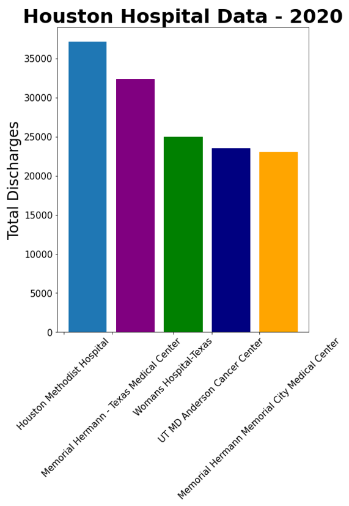

# Texas Hospital Discharge Trends -- Helping the community understand healthcare

**Author**: [Doug Mill](mailto:douglas_mill@live.com)

## Overview 

The healthcare system has always been something I've been interested in but never really understood well. It is an industry which is notorious for having hard to access data. This is fair because patient privacy comes first as it should. I was able to access some data from the Texas Department of State Health Services. It is all public use data and can be found at this link: https://www.dshs.texas.gov/thcic/hospitals/Inpatientpudf.shtm.
There was statistics on hospital discharges dating back to 2005 and the last year which has complete data is 2020. 2021 has partial data (quarter 1 only). I conducted some EDA on it but ultimately omitted it for visuals and my time series analysis. The reason why I chose discharges is because there is no implication on ethics or privacy, it shows some interesting trends of hospital usage over the years, and it is easy to understand. With the emergence of Covid in the past couple years, trends in healthcare and hospitals are as important as ever and I want to share my findings with the community.

## Business Understanding

I just want to share some information with the community that they might not have seen or understood otherwise. I am here to present some good news for the community about the efficiency of hospitals, the increased access and growing number of locations of hospitals over the years, and more. 

## Data Understanding and Preparation

The data that I am working with can be found in the aforementioned link. It is public use data. There are no names or privacy violations. I understand the importance of data ethics especially related to healthcare and made sure to navigate the general hospital trends rather than examine any individual patient data.
Each year from 2005 onwards has it's own data file. I performed EDA on each year and created some data visualizations. I also performed data analysis to draw some insights from the development of Texas hospitals over the years. Data engineering is required in order to aggregate the data and turn it into a time series. The time series data was aggregated into Houston hospital discharge time series and Texas hospital discharge time series.

Here are some of the visuals I've created:




## Modeling

Time Series modeling on the discharge data included ARMA models, LSTM, and Facebook Prophet.

## Results

## Conclusion

## Future Research

## References

Texas Inpatient Public Use Data File: https://www.dshs.texas.gov/thcic/hospitals/Inpatientpudf.shtm <br>
Big shout to Amar Kuppannan for inspiration. Check out his related blog here: https://medium.com/@ML_Treasures/forecasting-mortgage-rate-and-scraping-analyzing-the-realestateinvesting-subreddit-9ba4f1cb74b1

## Repository Structure

```
├── data
├── images
├── .gitignore
├── README.md
├── hospital_discharges_tx.ipynb
└── tx_hospital_timeseries.ipynb
